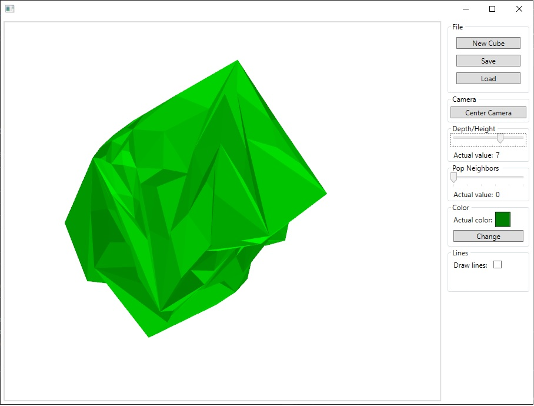

# 3DSculpture

_Application implemented as part of the **CAD / CAM Systems Laboratory** course, at the **MINI PW** faculty._

## 1. Application description
3D Sculpture is a program that allows the simple sculpting on a model build form triangle mesh. 
Application has two working modes: pushing triangle inside the model or pulling triangle outside the model.

The application provides:
*	Save and load model from stl text file format.
*	Reset model to the cube.
*	Change model color.
*	Enable/Disable drawing triangle's edges.
*	Change push depth/pull height parameter.
*	Change pull/push propagation on other edges/vertices.
*	Camera centering.

*3DSculpture Graphical User Interface*

More information about how to use 3DSculpture application [[3DSculpture instruction](instruction.md)]

